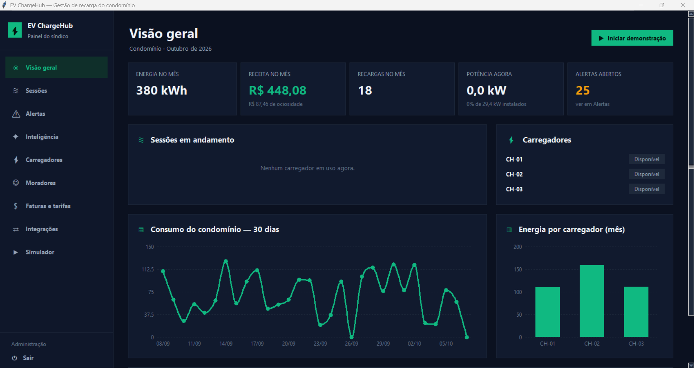
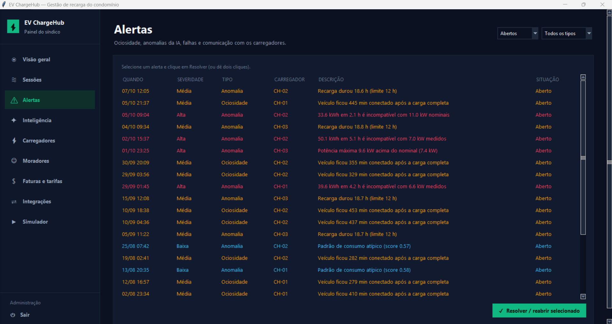
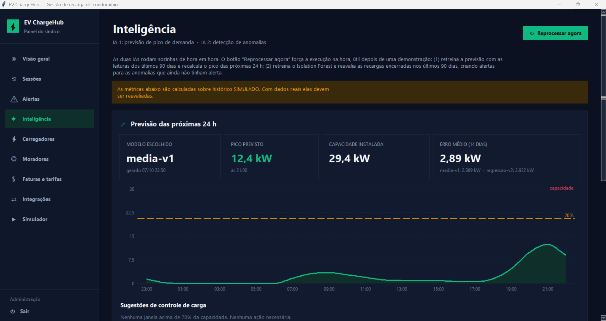
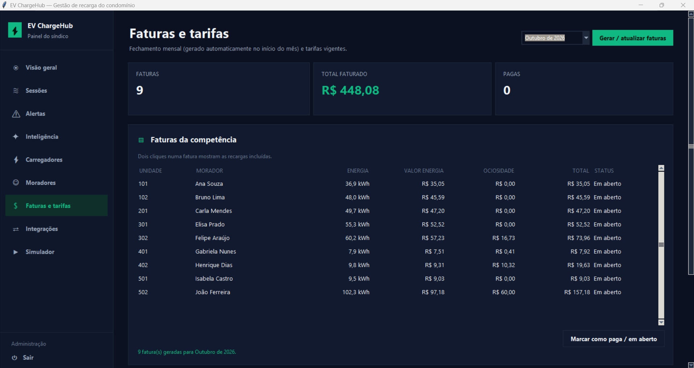

# EV ChargeHub: como funciona e como rodar

Sistema de gestão de recarga de veículos elétricos para condomínios com carregadores **GoodWe HCA G2**.
Ele autentica o morador pelo cartão RFID, acompanha a recarga em tempo real, cobra de cada unidade a energia
consumida e o tempo que o carro ficou parado ocupando a vaga, prevê o pico de consumo e detecta anomalias.

Tudo é feito **só com Python e a biblioteca padrão**: tkinter para a interface, sqlite3 para o banco,
socket/socketserver para o Modbus e threading para os processos em segundo plano. Não há Docker, banco
externo, pip install nem internet.

> **Sobre o hardware:** o projeto cobre apenas o software. Os carregadores são **simulados**: três
> carregadores virtuais conversam com o sistema por **Modbus TCP de verdade**. Para usar um GoodWe real,
> basta cadastrá-lo pelo IP e ajustar o mapa de registradores (seção 7).

---

## 1. Como rodar

### Windows (recomendado para apresentação)

1. Instale o **Python 3.11 ou mais novo** em [python.org/downloads](https://www.python.org/downloads/).
   - Na primeira tela do instalador, marque **"Add python.exe to PATH"**.
   - O instalador padrão já inclui o tkinter, então não é preciso instalar mais nada.
2. Abra a pasta do projeto e dê **dois cliques em `iniciar.bat`**.
3. Na primeira vez, o sistema cria o banco e gera 90 dias de histórico simulado (leva poucos segundos).
4. A tela de login já vem preenchida com o usuário administrador. Clique em **Entrar**.

### Linux / macOS

```bash
python3 main.py
```

No Linux pode ser preciso instalar o tkinter antes: `sudo apt install python3-tk`.

### Usuários de demonstração

| Perfil | E-mail | Senha |
|---|---|---|
| Síndico (administrador) | `admin@condominio.local` | `admin123` |
| Morador (Ana, apto 101) | `morador1@condominio.local` | `morador123` |
| Morador (Bruno, apto 102) | `morador2@condominio.local` | `morador123` |
| … até o morador 10 | `morador10@condominio.local` | `morador123` |

### Comandos úteis

| O que fazer | Como |
|---|---|
| Abrir o sistema | `iniciar.bat` ou `python main.py` |
| Apagar tudo e recomeçar do zero | `resetar.bat` ou `python main.py --reset` |
| Rodar os testes automáticos | `python -m unittest discover -s tests -t .` |
| Ver erros | arquivo `data/evcharge.log` |

### Problemas comuns

| Sintoma | Solução |
|---|---|
| "python não é reconhecido" | Reinstale o Python marcando *Add python.exe to PATH*. |
| "Este Python não tem o tkinter" | Reinstale pelo instalador oficial do python.org, com as opções padrão. |
| A janela abre e fecha | Rode `python main.py` num terminal para ver a mensagem e consulte `data/evcharge.log`. |
| Dados estranhos depois de muitos testes | `resetar.bat`. |

---

## 2. Visão geral do funcionamento

Um único programa Python. A interface roda na thread principal e o resto roda em segundo plano:

```
 ┌─────────────── Interface tkinter ────────────────┐
 │  Portal do morador         Painel do síndico     │
 └────────────────────▲─────────────────────────────┘
                      │ consultas
               ┌──────┴──────┐
               │   SQLite    │◄── Agendador: IA de hora em hora,
               │ evcharge.db │    faturas no início de cada mês
               └──────▲──────┘
                      │ grava sessões, leituras e alertas
           ┌──────────┴───────────┐
           │ Leitor Modbus        │  lê cada carregador 1× por segundo,
           │ (poller)             │  responde ao cartão RFID e aplica limite de corrente
           └──────────▲───────────┘
                      │ Modbus TCP
   ┌──────────────────┴───────────────────┐
   │ Simulador de carregadores            │  CH-01 11 kW · CH-02 11 kW · CH-03 7,4 kW
   │ (servidores Modbus em 127.0.0.1)     │  ← trocar pelo GoodWe real = mudar o IP
   └──────────────────────────────────────┘
```

### O caminho de uma recarga

1. **O morador aproxima o cartão** do carregador. O carregador publica o UID do cartão num registrador Modbus.
2. **O leitor Modbus vê o cartão** e confere no banco se ele existe, se está ativo e se o morador não tem
   outra recarga em andamento. Depois escreve **aceito** ou **negado** no carregador.
3. **Aceito:** o sistema abre uma sessão (`AUTORIZADA`). Se o carro não for conectado em 5 minutos, a sessão é cancelada.
4. **O carro é conectado** e a corrente sobe. A sessão passa para `CARREGANDO`, e o sistema registra energia,
   potência e corrente (uma leitura por minuto, ou sempre que o estado muda).
5. **Carga completa:** com a corrente próxima de zero por 2 minutos e o carro ainda conectado, a sessão vira
   `CARGA_COMPLETA` e começa a contar a **carência**.
6. **O carro é desconectado:** a sessão é `FINALIZADA` e o custo é calculado na hora.
7. Uma **falha** do carregador durante a recarga encerra a sessão como `FALHA`, cobrando só o que foi entregue.

```
AUTORIZADA ──► CARREGANDO ──► CARGA_COMPLETA ──► FINALIZADA
     │              │
     ▼              ▼
 CANCELADA        FALHA
```

### Cobrança (rateio)

| Item | Regra padrão (editável em *Faturas e tarifas*) |
|---|---|
| Energia | kWh consumidos × **R$ 0,95** |
| Carência | **15 min** grátis depois da carga completa |
| Ociosidade | **R$ 0,50 por minuto** parado após a carência |
| Teto | no máximo **R$ 60** de ociosidade por recarga |
| Fatura | uma por unidade por mês, gerada automaticamente no início do mês seguinte |

Cada recarga usa a tarifa que estava em vigor quando ela começou. Assim, mudar a tarifa não altera recargas antigas.

**Exemplo:** 15 kWh e 75 min parado depois da carga completa →
energia 15 × 0,95 = R$ 14,25; ociosidade (75 − 15) × 0,50 = R$ 30,00 → total **R$ 44,25**.

---

## 3. Inteligência artificial

As duas IAs rodam sozinhas **de hora em hora**. Em *Inteligência*, o botão **Reprocessar agora** força a
execução na hora, o que é útil depois de uma demonstração.

### IA 1: previsão de pico de demanda

- Monta o consumo do condomínio hora a hora com os últimos 90 dias de leituras.
- Treina dois modelos e testa ambos nos últimos 14 dias:
  - **média por dia da semana × hora** (`media-v1`);
  - **regressão linear** que combina essa média com o consumo da mesma hora 24 h e 7 dias antes (`regressao-v2`).
- Usa o modelo de **menor erro médio** para prever as próximas 24 h.
- Quando a previsão passa de **70% da capacidade instalada**, sugere limitar a corrente dos carregadores
  naquele horário. O limite é aplicado em *Carregadores → Limite de corrente*.

### IA 2: detecção de anomalias

Combina **regras explicáveis** com um **Isolation Forest** (implementado em Python puro):

| Regra | Quando dispara |
|---|---|
| Potência acima do nominal | potência medida > 110% da potência do carregador |
| Energia incompatível | kWh entregues > 105% do máximo possível no tempo da recarga |
| Ociosidade excessiva | carro parado mais de 60 min depois da carga completa |
| Sessão muito longa | recarga com mais de 12 h |
| Padrão atípico | o Isolation Forest considera a recarga muito diferente das demais |

O histórico simulado de 90 dias já contém anomalias injetadas de propósito. Assim, a tela *Inteligência*
mostra a **taxa de detecção** (100% no histórico gerado).

> As métricas são calculadas sobre dados **simulados**. Com dados reais, precisam ser reavaliadas.

---

## 4. As telas

### Portal do morador

| Tela | O que mostra |
|---|---|
| **Dashboard** | consumo e valor do mês, recarga ativa (energia, potência, % estimado da bateria, custo estimado, aviso de carência/ociosidade), gráfico diário e últimas recargas |
| **Histórico de recargas** | todas as recargas por mês, com energia, duração, ociosidade e valores |
| **Faturas** | faturas mensais; dois cliques mostram as recargas incluídas |
| **Configurações** | dados do morador, cartões RFID e veículos cadastrados |

### Painel do síndico

| Tela | O que mostra / faz |
|---|---|
| **Visão geral** | indicadores do mês, sessões ao vivo, status dos carregadores, consumo de 30 dias, energia por carregador, previsão de pico e o botão **▶ Iniciar demonstração** |
| **Sessões** | todas as recargas, com filtros |
| **Alertas** | ociosidade, anomalias da IA, cartões negados, falhas e carregadores offline; permite resolver/reabrir |
| **Inteligência** | IA 1 e IA 2, métricas e o botão **Reprocessar agora** |
| **Carregadores** | status, potência, limite de corrente, ativar/desativar e **Novo carregador** |
| **Moradores** | cadastro de moradores, cartões RFID (vincular/bloquear) e veículos |
| **Faturas e tarifas** | fechamento mensal, marcar fatura como paga, criar nova tarifa |
| **Integrações** | SEMS+ (GoodWe, simulado) e Open Charge Map (pontos públicos próximos; precisa da variável `OCM_API_KEY`) |
| **Simulador** | controle dos carregadores virtuais: passar cartão, conectar/desconectar veículo, provocar falha, velocidade do relógio e cenários prontos |

### Cadastrar um carregador novo

Em *Carregadores → Novo carregador*, escolha o **tipo**:

- **Simulado (demonstração):** cria um carregador virtual que fica **Disponível** em segundos. Ele aparece
  no Simulador, na Visão geral, nas sessões, nos alertas e nas faturas, e continua existindo quando o sistema
  é reaberto.
- **Equipamento real (IP na rede):** cadastra um GoodWe pelo endereço IP e porta Modbus. Ele aparece como
  **Offline** até o sistema conseguir se comunicar com o aparelho.

---

## 5. Demonstração para pitch (≈ 6 min)

Entre como **admin**, vá em **Visão geral** e clique em **▶ Iniciar demonstração**. O relógio do simulador
fica **60× mais rápido** (1 hora simulada por minuto real) e volta ao normal sozinho no fim.

| Carregador | Cartão | O que acontece |
|---|---|---|
| CH-01 | Ana (AB120001) | recarga normal de 30 kWh |
| CH-02 | Bruno (AB120002) | 15 kWh e fica 75 min parado → **multa por ociosidade** |
| CH-03 | desconhecido (FFFFFFFF) | cartão **negado** |
| CH-03 | Carla (AB120003) | medidor com defeito → **alerta de anomalia** |

Roteiro sugerido:

| Tempo | Tela | O que falar |
|---|---|---|
| 0:00 | Visão geral | 3 carregadores GoodWe; energia, receita e alertas do mês. Iniciar demonstração. |
| 0:30 | Visão geral | Ana e Bruno começam a carregar; cartão desconhecido negado no CH-03. |
| 1:30 | Simulador | Carregadores virtuais falando Modbus. "Com o equipamento real é só trocar o IP." |
| 2:00 | Sair → `morador2` → Dashboard | Recarga do Bruno ao vivo; depois da carga completa, carência e taxa de ociosidade. |
| 3:30 | Sair → admin → Alertas | Ociosidade do CH-02 e potência acima do nominal no CH-03. |
| 4:30 | Inteligência | Previsão de pico (IA 1) e detecção de anomalias (IA 2). |
| 5:15 | Faturas e tarifas | Rateio mensal por unidade; regras configuráveis. |

A demonstração continua rodando enquanto você troca de usuário. Tudo funciona **offline**.

---

## 6. Estrutura de pastas

```
ev-chargehub/
├── main.py                 ponto de entrada  (python main.py [--reset])
├── iniciar.bat             duplo clique para abrir (Windows)
├── resetar.bat             apaga o banco e recomeça
├── requirements.txt        vazio de propósito: só biblioteca padrão
├── README.md
├── evcharge/
│   ├── config.py           tarifa padrão, carregadores, limites da IA
│   ├── db.py               banco SQLite: tabelas e acesso
│   ├── seed.py             usuários de demonstração e 90 dias de histórico
│   ├── runtime.py          liga simulador, leitor Modbus e agendador
│   ├── hardware/           ── CAMADA SIMULADA (mock do hardware) ──
│   │   ├── registers.py    mapa de registradores Modbus (fictício)
│   │   ├── modbus.py       servidor e cliente Modbus TCP
│   │   ├── charger.py      comportamento do carregador e do veículo
│   │   ├── simulator.py    carregadores virtuais + relógio acelerável
│   │   └── scenarios.py    roteiros de demonstração
│   ├── core/               ── REGRAS DE NEGÓCIO ──
│   │   ├── gateway.py      traduz registradores em leituras
│   │   ├── poller.py       lê os carregadores a cada segundo
│   │   ├── sessions.py     máquina de estados da recarga + RFID
│   │   ├── billing.py      cálculo de energia + ociosidade
│   │   ├── invoices.py     fechamento mensal das faturas
│   │   ├── repo.py         acesso ao banco usado pelas regras
│   │   └── auth.py         login (senhas com PBKDF2)
│   ├── ai/                 ── INTELIGÊNCIA ──
│   │   ├── forecast.py     IA 1: previsão de pico
│   │   ├── anomaly.py      IA 2: regras + Isolation Forest
│   │   ├── history.py      gerador do histórico simulado
│   │   └── service.py      executa as IAs sobre o banco
│   ├── services/
│   │   ├── queries.py      consultas usadas pelas telas
│   │   └── integrations.py SEMS+ (simulado) e Open Charge Map
│   └── ui/                 ── INTERFACE TKINTER ──
│       ├── app.py          janela, login e menu lateral
│       ├── theme.py        cores e fontes (baseadas no protótipo Figma)
│       ├── widgets.py      cartões, botões, tabelas, formulários
│       ├── charts.py       gráficos de linha, área e barras
│       └── pages/          uma tela por arquivo
├── tests/                  testes automáticos (unittest)
├── docs/                   arquitetura, roteiro, mapa de registradores, vídeo da demonstração
└── data/                   criado ao rodar: evcharge.db e evcharge.log
```

### Banco de dados (`data/evcharge.db`)

| Tabela | Conteúdo |
|---|---|
| `usuarios`, `cartoes_rfid`, `veiculos` | moradores, administrador, cartões e carros |
| `carregadores` | equipamentos, endereço Modbus, status atual e limite de corrente |
| `tarifas` | regras de cobrança com período de vigência |
| `sessoes` | cada recarga, com energia, tempos, ociosidade e valores |
| `leituras` | série temporal de potência, corrente e energia |
| `faturas`, `itens_fatura` | fechamento mensal por unidade |
| `alertas` | ociosidade, anomalias, falhas, cartões negados |
| `previsoes`, `execucoes_ia` | resultados e métricas das IAs |

Os valores em dinheiro são guardados como texto decimal (sem erro de arredondamento) e as datas em UTC.

---

## 7. Do simulador para o equipamento real

1. Conseguir com a GoodWe o **manual Modbus do HCA G2**.
2. Ajustar **somente** `evcharge/hardware/registers.py` (endereços, tipos, escalas e códigos de status).
   Nenhum outro arquivo depende dos endereços.
3. Em *Carregadores → Novo carregador*, escolher **Equipamento real** e informar o IP e a porta (normalmente 502).
4. Pontos a confirmar com o fabricante:
   - se o HCA G2 expõe o UID do cartão RFID via Modbus;
   - se aceita autorização remota (senão, a autorização fica na lista local do carregador ou no SEMS+);
   - se aceita escrita do limite de corrente.

O mapa atual (fictício) está documentado em `docs/mapa-registradores.md`.

---

## 8. Testes

```bash
python -m unittest discover -s tests -t .
```

| Arquivo | O que verifica |
|---|---|
| `test_modbus.py` | protocolo Modbus TCP (codificação, leitura, escrita, proteção de registradores, servidor fora do ar) |
| `test_rateio.py` | cálculo de energia, carência, ociosidade, teto, faturas e igualdade entre a receita da Visão geral e o total faturado |
| `test_sessoes.py` | máquina de estados da recarga, cartões negados, autorização expirada, falhas, mesmo cartão em dois carregadores |
| `test_ia.py` | previsão de pico e detecção de anomalias |
| `test_integracao.py` | sistema completo via TCP: roteiro do pitch, limite de corrente, queda e volta do simulador, carregador simulado novo |
| `test_interface.py` | abre todas as telas como síndico e como morador (pulado em computador sem tela) |

Resultado atual: 28 testes, todos passando (os 2 de interface são pulados em ambiente sem tela).

---

## 9. Evidências de funcionamento

| Evidência | Onde está |
|---|---|
| Vídeo de demonstração (3min29s) | [youtu.be/ClzriXOV_eU](https://youtu.be/ClzriXOV_eU) |
| Capturas de tela | `docs/capturas/` (reproduzidas abaixo) |
| Suíte de testes automáticos | `python -m unittest discover -s tests -t .` (28 testes) |
| Demonstração ao vivo | *Visão geral → ▶ Iniciar demonstração* (roteiro na seção 5) |
| Métricas das IAs | tela *Inteligência*, com erro médio da previsão e taxa de detecção de anomalias |

O vídeo percorre o roteiro da seção 5: recarga normal, multa por ociosidade, cartão negado, alerta de
anomalia, previsão de pico e fechamento das faturas.

### Visão geral do síndico

Indicadores da competência, estado dos três carregadores, consumo diário dos últimos 30 dias e energia por
carregador.



### Alertas

Saída das duas IAs e dos eventos operacionais, com severidade e descrição em linguagem direta. As anomalias
trazem o motivo que disparou a regra, como "33.6 kWh em 2.1 h é incompatível com 11.0 kW nominais".



### Inteligência

IA 1 com o modelo escolhido automaticamente por menor erro, pico previsto para as próximas 24 h e a linha de
70% da capacidade que dispara a sugestão de controle de carga.



### Faturas e tarifas

Fechamento mensal por unidade, separando energia e ociosidade. Nove faturas para dez moradores: quem não
registrou recarga no mês não recebe fatura, conforme definido na sprint 01.



---

## 10. Relação com a sprint 01

A solução entregue implementa o que foi projetado na sprint 01. O fluxo central é o mesmo: a sessão é lida
por Modbus TCP, o usuário é identificado pelo cartão RFID, o motor de rateio cobra a energia consumida mais
a ociosidade, as duas IAs (previsão de pico e detecção de anomalias) atuam sobre o histórico e as duas
interfaces continuam separadas por perfil, morador e síndico. O modelo de dados também é o mesmo: as sete
entidades, seus atributos e seus relacionamentos saíram do esquema da sprint 01 para o banco sem mudança de
modelagem.

As decisões técnicas tomadas durante o desenvolvimento estão registradas abaixo. São três, e cada uma
responde a uma restrição concreta da fase de prototipação.

### Decisão 1: rodar sem instalação

A sprint 01 desenhou a plataforma no formato em que ela seria operada em produção: PostgreSQL, backend
expondo APIs REST e frontend web separado. Para a entrega da sprint 02, o requisito mais forte passou a ser
outro, que qualquer pessoa consiga executar o protótipo e avaliar a lógica sem montar ambiente. Optamos por
usar apenas a biblioteca padrão do Python, sem dependência externa nenhuma.

| Em produção (sprint 01) | No protótipo | Efeito |
|---|---|---|
| PostgreSQL, chaves UUID | SQLite, `INTEGER PRIMARY KEY` | Mesmas sete entidades e mesmas chaves estrangeiras, sem servidor de banco para instalar. |
| Backend REST + frontend separado | Processo único; a interface consulta o banco pela camada `services/queries.py` | Sem porta, CORS ou build. A fronteira entre regra de negócio e apresentação continua existindo no código, só não atravessa a rede. |
| Interface web | Interface desktop em tkinter, com a paleta e o layout do protótipo Figma | tkinter já vem com o Python, o que dispensa Node e npm. As telas e a hierarquia de informação do Figma foram preservadas. |

A camada de regras de negócio (`evcharge/core/`) não conhece nem o banco nem a interface, então a migração
para PostgreSQL com API REST é troca de borda, não reescrita.

### Decisão 2: camada de hardware simulada, com ponto de troca único

O laboratório expõe o HCA G2 pelo portal SEMS+, mas sem acesso programático ao equipamento para leitura e
escrita de registradores em tempo real, que é o que o protótipo precisa exercitar. Em vez de simular o
carregador por dentro do código, construímos três carregadores virtuais que **falam Modbus TCP de verdade**,
em socket puro, respondendo FC03, FC06 e FC16. O sistema conversa com eles pela rede, exatamente como
conversaria com o equipamento físico.

Isso concentra toda a dependência de hardware em um arquivo, `evcharge/hardware/registers.py`. O mapa de
registradores levantado na sprint 01 segue valendo como referência de migração, e a seção 7 descreve o
procedimento. O faturamento usa a energia acumulada da sessão; com equipamento real, a diferença do medidor
MID entra como fonte preferencial e a energia acumulada passa a fallback, como a sprint 01 já previa. A tela
de *Integrações* mantém o contrato de dados do SEMS+ alimentado por dados simulados, e a integração com o
Open Charge Map está funcional de verdade, consumindo a API pública.

### Decisão 3: refinamento do modelo de rateio

Dois ajustes no modelo surgiram ao implementar o cálculo e observar o comportamento das sessões:

| Sprint 01 | Implementado | Motivo |
|---|---|---|
| Ociosidade como `tempo × taxa horária` | Taxa por minuto, com 15 min de carência e teto de R$ 60 por recarga | A carência evita cobrar de quem não tem como chegar na vaga no instante em que a carga termina, e o teto limita o valor em caso de esquecimento prolongado. Os dois tornam a regra mais defensável em assembleia, e ambos são configuráveis em *Faturas e tarifas*. |
| Estados do carregador conforme o registrador 10017 | Máquina de estados de negócio: `AUTORIZADA`, `CARREGANDO`, `CARGA_COMPLETA`, `FINALIZADA`, `FALHA`, `CANCELADA` | Os códigos do equipamento descrevem o hardware; a cobrança precisa de estados próprios. `CARGA_COMPLETA` marca o início da ociosidade, que nenhum código do HCA G2 expressa isoladamente. A tradução entre os dois vocabulários fica em `core/gateway.py`. |

### Onde a entrega foi além

Nos dois módulos de IA a sprint 01 deixava a escolha do algoritmo aberta, e implementamos as duas opções em
cada caso. Na IA 1, previa "regressão linear **ou** média temporal móvel": o sistema treina as duas, mede o
erro de cada uma nos últimos 14 dias e usa automaticamente a de menor erro. Na IA 2, previa "regras
heurísticas **ou** Isolation Forest": as duas camadas operam juntas, com as regras garantindo
explicabilidade do alerta e o Isolation Forest (escrito em Python puro) capturando os padrões atípicos que
as regras não descrevem.
